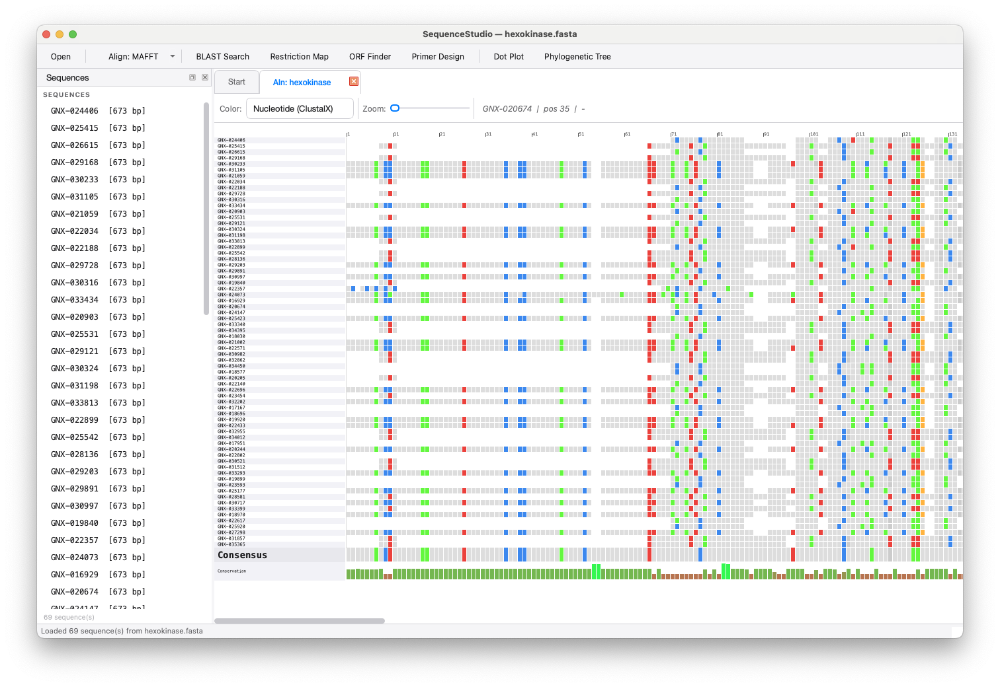

# SequenceStudio by GOENOMICS

A modern, cross-platform biological sequence analysis workbench built with Python and PySide6 (Qt6). All bioinformatics computation uses BioPython.



*Multiple sequence alignment of 69 hexokinase sequences (673 bp each), coloured with the ClustalX nucleotide scheme. The left panel lists all loaded sequences; the viewer shows per-residue colours, a position ruler, a consensus row, and a conservation bar at the bottom.*

## Features

- **Sequence Editor** — Open FASTA, GenBank, Clustal, NEXUS, PHYLIP files
- **Multiple Sequence Alignment** — MAFFT or MUSCLE via subprocess, full colored MSA viewer
- **BLAST Search** — Remote NCBI BLAST (blastn, blastp, blastx, tblastn, tblastx)
- **Restriction Enzyme Map** — Visual linear/circular restriction maps
- **ORF Finder** — All 6 reading frames, configurable minimum length
- **Gene Prediction** — Auto backend selection: pyrodigal (if installed) with ORF fallback, GFF3 import/export, transcript/protein FASTA export, feature filters, parent/child links, and multi-track visualization for gene/mRNA/exon/CDS features
- **Primer Design** — Tm calculation, GC%, hairpin check, nearest-neighbor thermodynamics
- **Dot Plot** — Pairwise sequence comparison
- **Phylogenetic Tree** — Neighbor-joining tree from an alignment

## Requirements

- Python 3.10+
- macOS 12+ recommended (runs on Linux/Windows too)

## Installation

```bash
cd SequenceStudio
python3 -m venv venv
source venv/bin/activate
pip install -r requirements.txt
```

### Optional: alignment tools

```bash
brew install mafft muscle
```

### Optional: gene prediction backend

```bash
pip install pyrodigal
```

Without pyrodigal, SequenceStudio automatically falls back to a built-in ORF-based predictor.
The Gene Prediction view also includes a future-facing eukaryotic backend slot, which currently uses the ORF fallback until an AUGUSTUS/BRAKER-style backend is integrated.

## Running

```bash
python main.py
```

## External Tools (optional)

| Tool | Install | Used for |
|---|---|---|
| MAFFT | `brew install mafft` | MSA (recommended) |
| MUSCLE | `brew install muscle` | MSA (alternative) |

A pure-Python built-in aligner is available with no external tools required.
BLAST is remote via NCBI — no local install needed.

## Licensing

SequenceStudio is offered under a dual-license model:

- Open-source license: LGPL-2.1-or-later (see [LICENSE](LICENSE))
- Commercial license: proprietary terms for commercial/proprietary redistribution and integration (see [LICENSE-COMMERCIAL](LICENSE-COMMERCIAL))

For commercial licensing inquiries, contact GOENOMICS via [goenomics.com](https://goenomics.com).
